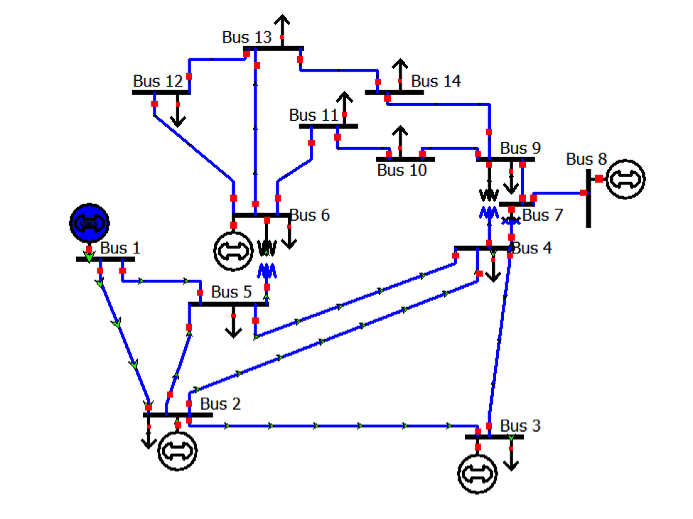
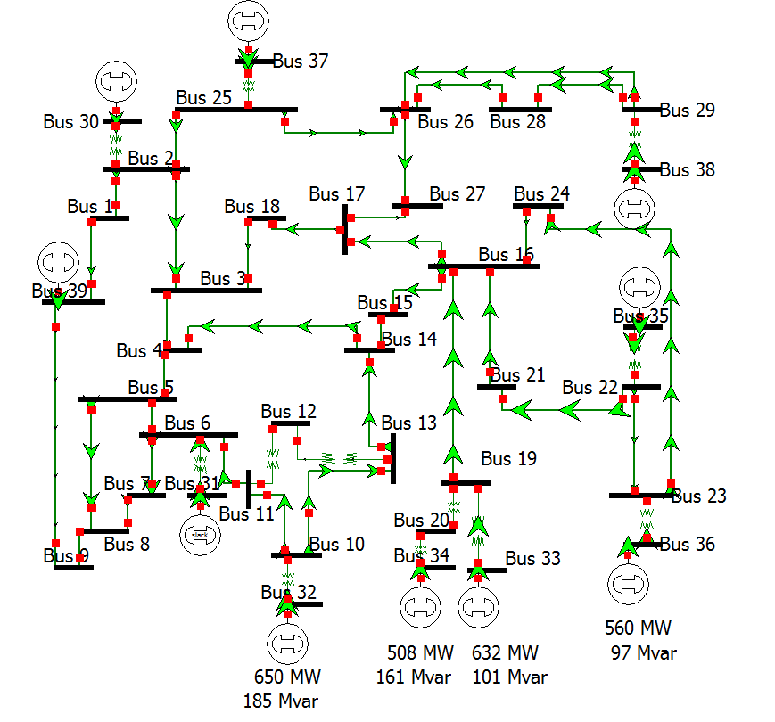
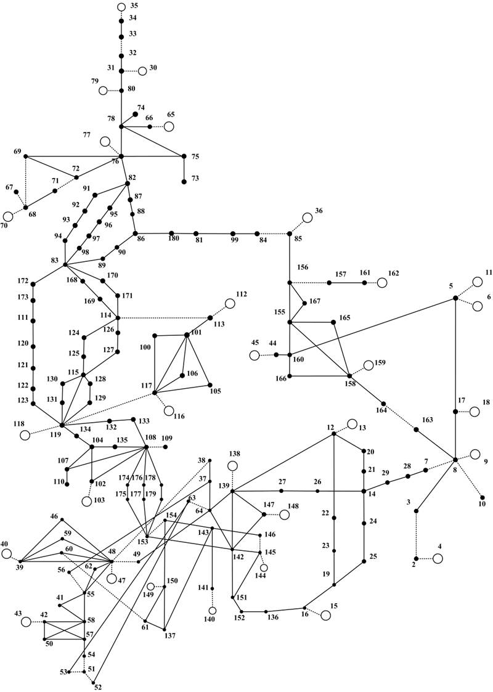

# 电力系统暂态稳定性与连续工况泛化数据集

本数据集使用 **ANDES 电力系统仿真软件**生成，覆盖 IEEE 14、IEEE 39 和 WECC 179 三个系统，用于研究负荷水平、新能源渗透率及节点功率分布变化下的暂态稳定性。

**数据下载：Zenodo（记录链接 / DOI 待发布后补充）。** 主数据以 PyTorch `.pt` 张量提供，节点分布变化扩展集沿用 `.npz` 格式并打包为 ZIP。

## 数据集包含什么

**连续工况主数据集**：每个系统包含 10 个负荷水平与 10 个新能源渗透率组合，共 100 个工况；三个系统合计 **702,400 个故障样本**。一个样本对应一个工况下的一次故障仿真。

| 系统 | 文件 | 样本数 | 每个样本的动态张量 |
| --- | --- | ---: | --- |
| IEEE 14 | `ieee14_cdg_10x10.pt` | 78,000 | `240 × 38` |
| IEEE 39 | `ieee39_cdg_10x10.pt` | 524,400 | `240 × 98` |
| WECC 179 | `wecc179_cdg_10x10.pt` | 100,000 | `240 × 416` |

张量形状为“时间步 × 变量数”，保存故障发生后 **2 s** 的动态观测，即仿真时间 `[1.0, 3.0)` s。不同系统的通道数分别为 38、98 和 416。

**节点分布变化扩展集**：在总负荷和总新能源有功出力固定的条件下，改变不同节点的功率分配，包含仅负荷、仅新能源、两者联合变化三类，最大节点相对变化幅度为 **5%、10%、20%**。每个系统选取 4 个工况，每个工况包含 1 个基准及 18 个扰动场景，每个场景对应相同的 30 个故障事件。合计 **6,840 次仿真记录**，其中 6,480 条具有完整有效动态输入，保存故障发生起的前 12 个采样点、标签、求解状态及角差摘要。文件为 `node_redistribution_3systems.zip`。

## 有哪些变量

| 类别 | 变量与单位 | 保存位置 |
| --- | --- | --- |
| 发电机动态量 | 同步发电机转子角（°）、频率（Hz） | 主数据 `data_full`；扩展集 `time_x` |
| 母线动态量 | 电压幅值（p.u.）、电压相角（°） | 主数据 `data_full`；扩展集 `time_x` |
| 工况描述符 | 负荷等级、新能源渗透率（%）及其归一化坐标 | 主数据 `descriptor_raw`、`descriptor_norm`；扩展集参考文件 `descriptor` |
| 故障信息 | 故障母线、切除线路、故障持续时间及动作时刻 | 主数据 `sample_meta`；扩展集 `manifest.json` |
| 稳定性标签 | `1 / True` 为稳定，`0 / False` 为失稳 | 主数据 `labels`；扩展集 `metadata` |
| 仿真状态 | 收敛状态、实际仿真终点、机间角差等 | 主数据 `sample_meta`；扩展集 `metadata`、`angle_spread` |

主数据按 `systems[系统名][工况名]` 组织，`columns_full` 给出动态变量的准确名称与顺序，`time_s_full` 给出采样时刻。扩展集的 `time_x` 按时间优先展平，其参考文件还提供变量名 `columns` 和拓扑特征 `topo_x`；使用时应保留输入有效性标记，排除缺少完整观测或发生执行错误的记录。

## 仿真与生成逻辑

1. **构造运行工况**：调节负荷等级和新能源渗透率，形成每个系统的二维工况网格，并求解初始潮流。工况范围及归一化方式如下表。
2. **施加故障并仿真**：使用 ANDES 进行时域仿真，在 1 s 施加三相母线短路及线路切除事件，改变故障位置、切除线路和故障持续时间。系统基准频率为 **60 Hz**，动态变量采样率为 **120 Hz**，仿真目标终点为 **15 s**。
3. **生成稳定性标签**：仿真收敛、到达 15 s 且故障清除后的最大机间转子角差不超过 **180°**，记为稳定；否则按数据生成规则记为失稳。求解未完成的记录保留相应状态，便于区分数值终止与角差越限。
4. **提取与保存数据**：从仿真轨迹截取短时动态窗口，与标签、工况和故障信息一起保存。主 `.pt` 保存 2 s 动态窗口，标签依据完整仿真过程生成。扩展集保持原故障事件和总量约束，改变节点分配后重新仿真、重新生成标签。

| 系统 | 负荷等级 | 新能源渗透率 | 归一化坐标 `[负荷, 新能源]` |
| --- | --- | --- | --- |
| IEEE 14、IEEE 39 | 80%–120% | 0%–50% | `[(load - 80) / 40, renewable / 50]` |
| WECC 179 | 70%–100% | 0%–60% | `[(load - 70) / 30, renewable / 60]` |

上式输入为百分数数值，输出均位于 `[0,1]`。实际工况取值保存在 `grid` 中，IEEE 14/39 的物理取值并非等间距。节点分布变化扩展集保持工况描述符不变；例如 20% 扰动表示节点设定值的最大相对变化，不表示新能源渗透率增加 20 个百分点。

## 系统拓扑

以下为公开基准系统的拓扑示意图；本数据中的动态模型、新能源配置和故障状态以实际仿真设置为准。

### IEEE 14

来源：[Texas A&M Electric Grid Test Case Repository](https://electricgrids.engr.tamu.edu/electric-grid-test-cases/ieee-14-bus-system/)。

### IEEE 39

来源：[Texas A&M Electric Grid Test Case Repository](https://electricgrids.engr.tamu.edu/electric-grid-test-cases/new-england-ieee-39-bus-system/)。

### WECC 179

来源：[University of Tennessee / Kai Sun — Test Cases Library](https://web.eecs.utk.edu/~kaisun/Oscillation/basecase.html)。图片权利归原来源。
